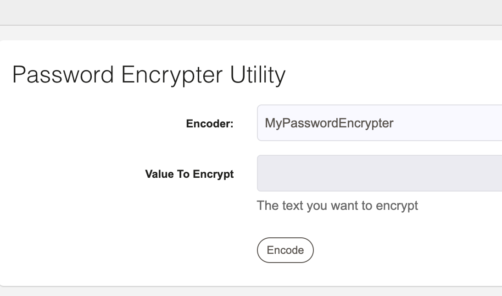

#Example Password Utility Plugin plus Workflow Step plugin

This is an example about how to use a Password Utility Plugin along with a workflow step in order to encrypt password using the GUI and decrypt them on a workflow step.

 
## Install 

* build: `gradle clean build`
* install: copy the file `build/libs/example-ws-encrypter-0.1.0.jar` to libext folder

## Use 

* go to Password Utility page

* Select the option MyPasswordEncrypter

* type a value and encrypt it. Copy the result

* go to the job example, pass the encrypted value and run the job

